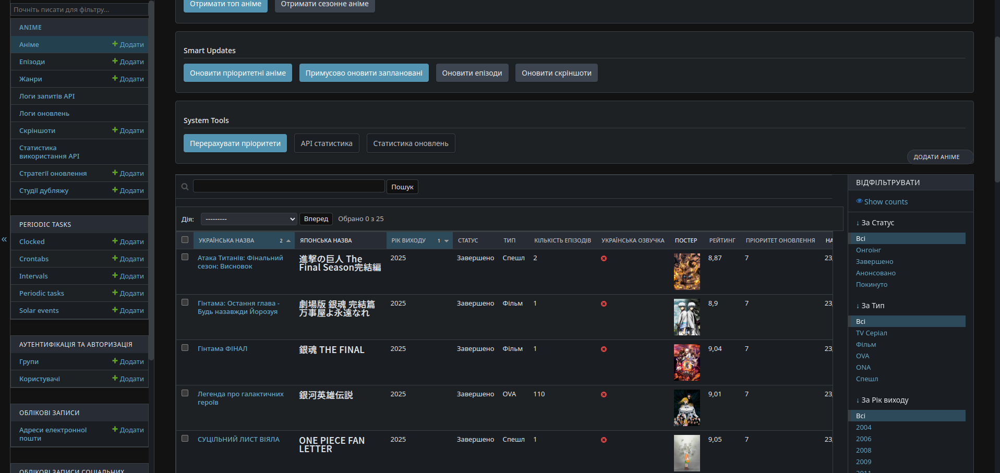
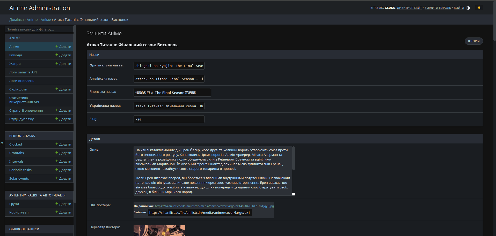
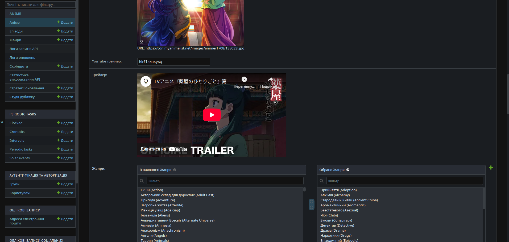
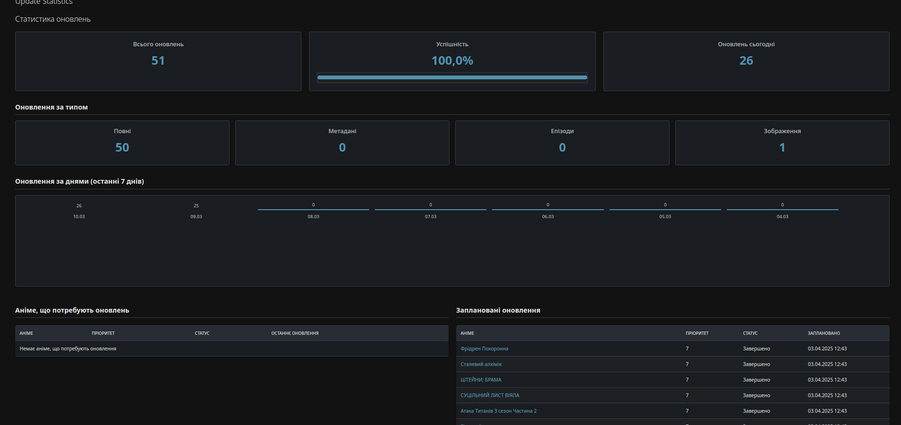
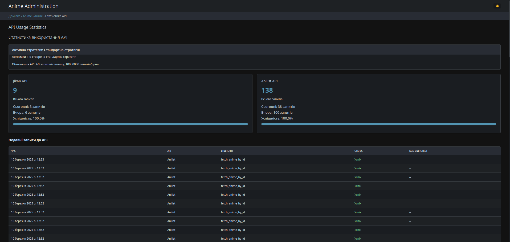

# 🌸 Anime DB Backend & API Integration


<details>
<summary><b>🇬🇧 English Version (click to expand)</b></summary>

# 🌸 Anime DB Backend & API Integration

A powerful backend service for collecting and managing anime data using external APIs.

## 🎯 Project Purpose

This project is a specialized backend that automates the process of collecting, updating, and storing information about anime from the Jikan API (MyAnimeList) and AniList API. The system is optimized to work within API limitations and supports intelligent database update scheduling.

<div align="center">
    
</div>

## 📌 Key Features

- 🗄️ **Automated data collection** from MyAnimeList and AniList APIs into a unified database
- 🔄 **Intelligent API rate limiting** with adaptive waiting and exponential backoff
- 🧠 **Priority-based update system** that favors current and popular anime
- 📊 **Enhanced administrative panel** with API monitoring and update statistics
- 🔍 **Different update types** (full, metadata, episodes, images) for optimal API usage
- 🇯🇵 **Japanese text support** with optimized display

## 💻 Technology Stack

- **Framework**: Django 5.1 with Django REST Framework
- **Database**: PostgreSQL for reliable data storage
- **Asynchronous tasks**: Celery for scheduling and performing updates
- **Virtualization**: Docker and Docker Compose for easy deployment
- **Monitoring**: Built-in tools for tracking API and system metrics

## 🚀 Installation and Launch

### Using Docker (recommended):

```bash
# Clone the repository
git clone https://github.com/gh0stluko/anime.git
cd anime

# Set up environment variables
cp .env.example .env
# Edit .env according to your environment

# Launch with Docker Compose
docker-compose up -d
```

### Local installation (for development):

```bash
# Create virtual environment
python -m venv venv
source venv/bin/activate  # Linux/Mac
# or
venv\Scripts\activate     # Windows

# Install dependencies
cd backend
pip install -r requirements.txt

# Database migrations
python manage.py migrate

# Run development server
python manage.py runserver
```

## 📊 Administrative Interface

The system includes an enhanced admin panel for monitoring and managing anime updates:

<div align="center">
    <div>
        
        
    </div>
    <div>
        
        
    </div>
</div>

## 🧠 Intelligent Update System

The backend uses a sophisticated update algorithm that provides:

- **Smart prioritization**: Ongoing anime are updated daily, announced ones weekly, and completed ones monthly
- **Adaptive waiting between requests**: The system dynamically adjusts delays according to API usage
- **Differentiated updates**: Separate operations for updating metadata, episodes, and images
- **Detailed monitoring**: Complete statistics on update success and API usage

## 📄 License

This project is distributed under the MIT license. See the [LICENSE](LICENSE) file for details.

</details>

## 🎯 Призначення проекту

Цей проект є спеціалізованим бекендом, який автоматизує процес збору, оновлення та зберігання інформації про аніме з Jikan API (MyAnimeList) та AniList API. Система оптимізована для роботи з обмеженнями API та підтримує розумне планування оновлень бази даних.

<div align="center">
    
</div>

## 📌 Ключові можливості

<details>
<summary><b>👉 Розгорнути детальний опис можливостей</b></summary>

- 🗄️ **Автоматизований збір даних** з MyAnimeList та AniList API в єдину базу даних з підтримкою інкрементальних оновлень
- 🔄 **Інтелектуальне обмеження швидкості API** з адаптивним очікуванням та експоненціальним відступом для дотримання лімітів
- 🧠 **Система пріоритетного оновлення**, яка надає перевагу актуальним та популярним аніме (онгоінги оновлюються щодня)
- 📊 **Розширена адміністративна панель** з моніторингом API та статистикою оновлень, графіками використання та повним логуванням
- 🔍 **Різні типи оновлень** (повні, метадані, епізоди, зображення) для оптимального використання API та швидкого оновлення найважливіших даних
- 🇯🇵 **Підтримка японського тексту** з оптимізованим відображенням та інтеграцією шрифтів Noto Sans JP

</details>

- 🗄️ **Автоматизований збір даних** з MyAnimeList та AniList API в єдину базу даних
- 🔄 **Інтелектуальне обмеження швидкості API** з адаптивним очікуванням
- 🧠 **Система пріоритетного оновлення**, яка надає перевагу актуальним аніме
- 📊 **Розширена адміністративна панель** з моніторингом API
- 🔍 **Різні типи оновлень** для оптимального використання API
- 🇯🇵 **Підтримка японського тексту** з оптимізованим відображенням

## 💻 Технічний стек

<details>
<summary><b>👉 Розгорнути повний технічний опис</b></summary>

- **Фреймворк**: Django 5.1 з Django REST Framework для створення API
- **База даних**: PostgreSQL для надійного зберігання даних з підтримкою складних запитів та JSON-полів
- **Асинхронні завдання**: Celery для планування та виконання оновлень з підтримкою періодичних задач
- **Віртуалізація**: Docker та Docker Compose для простого розгортання в будь-якому середовищі
- **Моніторинг**: Вбудовані інструменти для відстеження API та системних метрик з візуалізацією даних
- **Кешування**: Redis для швидкого доступу до часто використовуваних даних

</details>

- **Фреймворк**: Django 5.1 з Django REST Framework
- **База даних**: PostgreSQL для надійного зберігання даних
- **Асинхронні завдання**: Celery для планування та виконання оновлень
- **Віртуалізація**: Docker та Docker Compose для простого розгортання
- **Моніторинг**: Вбудовані інструменти для відстеження API

## 🚀 Встановлення та запуск

<details>
<summary><b>Використання Docker (рекомендовано)</b></summary>

```bash
# Клонування репозиторію
git clone https://github.com/gh0stluko/anime.git
cd anime

# Налаштування змінних середовища
cp .env.example .env
# Відредагуйте .env відповідно до вашого середовища

# Запуск з Docker Compose
docker-compose up -d
```

</details>

<details>
<summary><b>Локальне встановлення (для розробки)</b></summary>

```bash
# Створення віртуального середовища
python -m venv venv
source venv/bin/activate  # Linux/Mac
# або
venv\Scripts\activate     # Windows

# Встановлення залежностей
cd backend
pip install -r requirements.txt

# Міграції бази даних
python manage.py migrate

# Запуск сервера розробки
python manage.py runserver
```

</details>

### Використання Docker (рекомендовано):
```bash
git clone https://github.com/gh0stluko/anime.git && cd anime
cp .env.example .env
docker-compose up -d
```

## 📊 Адміністративний інтерфейс

Система включає розширену адмін-панель для моніторингу та керування оновленнями аніме:

<details>
<summary><b>👉 Переглянути всі скріншоти</b></summary>
<div align="center">
    <div>
        
        
    </div>
    <div>
        
        
    </div>
</div>
</details>

<div align="center">
    
</div>

## 🧠 Інтелектуальна система оновлень

<details>
<summary><b>👉 Докладно про алгоритми оновлення</b></summary>

Бекенд використовує складний алгоритм оновлення, який забезпечує:

- **Розумну пріоритизацію**: Онгоінг-аніме оновлюються щодня, анонсовані — щотижня, завершені — щомісяця
- **Адаптивне очікування між запитами**: Система динамічно регулює затримки відповідно до використання API, застосовуючи експоненціальний відступ при наближенні до лімітів
- **Диференційовані оновлення**: Окремі операції для оновлення метаданих, епізодів та зображень, що дозволяє оптимально використовувати ресурси API
- **Детальний моніторинг**: Повна статистика успішності оновлень та використання API з візуалізацією даних та сповіщенням про проблеми

</details>

Бекенд використовує алгоритм розумного оновлення:

- **Пріоритизація за статусом**: Онгоінги — щодня, анонсовані — щотижня
- **Адаптивне очікування**: Динамічне регулювання затримок між запитами
- **Різні типи оновлень**: Метадані, епізоди або зображення
- **Моніторинг**: Статистика успішності та використання API

## 📄 Ліцензія

Цей проект розповсюджується під ліцензією MIT. Детальніше у файлі [LICENSE](LICENSE).
